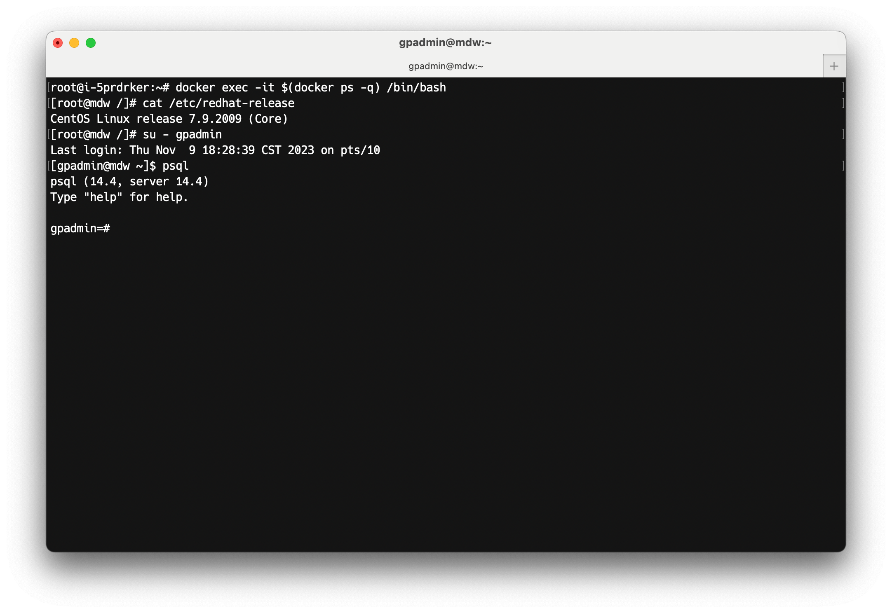

# Apache Cloudberry (Incubating) Bootcamp

These tutorials showcase how Apache Cloudberry can address day-to-day tasks performed in typical DW, BI and data science environments. It is designed to be used with the Apache Cloudberry Sandbox, which is based on the Docker with the Rocky Linux 9.4 OS.

## Bootcamp Outline

1. [000-Cloudberry Sandbox](./000-cbdb-sandbox/)
2. [101-Cloudberry Tutorials](./101-cbdb-tutorials)
   - [Lesson 0: Introduction to Database and Cloudberry Architecture](./101-cbdb-tutorials/101-0-introduction-to-database-and-cloudberrydb-architecture.md)
   - [Lesson 1: Create Users and Roles](./101-cbdb-tutorials/101-1-create-users-and-roles.md)
   - [Lesson 2: Create and Prepare Database](./101-cbdb-tutorials/101-2-create-and-prepare-database.md)
   - [Lesson 3: Create Tables](./101-cbdb-tutorials/101-3-create-tables.md)
   - [Lesson 4: Data Loading](./101-cbdb-tutorials/101-4-data-loading.md)
   - [Lesson 5: Queries and Performance Tuning](./101-cbdb-tutorials/101-5-queries-and-performance-tuning.md)
   - [Lesson 6: Backup and Recovery Operations](./101-cbdb-tutorials/101-6-backup-and-recovery-operations.md)
3. [102-Cloudberry Crash Course](./102-cbdb-crash-course/)
4. [103-Cloudberry Performance Benchmark](./103-cbdb-performance-benchmark/)
5. [104-Cloudberry for Data Science](./104-cbdb-for-datascience/)

## Contribution

Thanks to all the contributors:

We welcome your contributions to the Apache Cloudberry (Incubating) Bootcamp. Please see our [CONTRIBUTING.md](./CONTRIBUTING.md) for more details.

## License

Licensed under Apache License Version 2.0. For more details, please refer to
the [LICENSE](./LICENSE).

## Acknowledgments

Thanks to the [Vmware Greenplum Sandbox
project](https://github.com/vmware-archive/gpdb-sandbox-tutorials.git) for the
inspiration.
